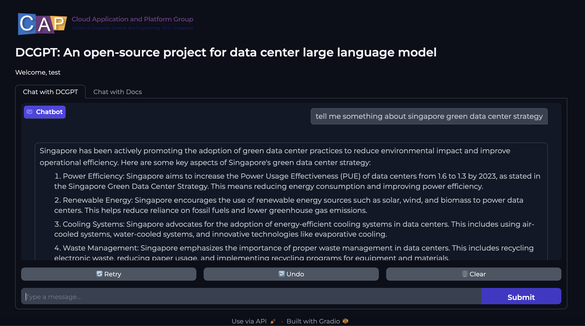
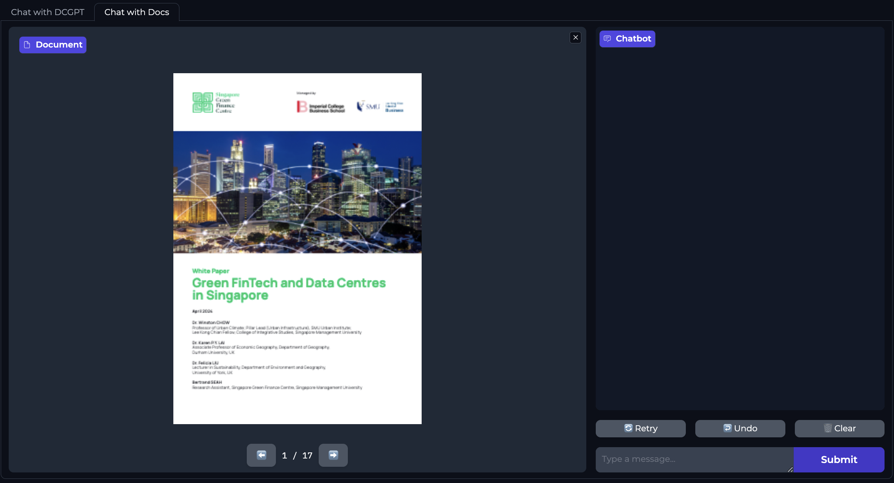

# DCGPT: Open-Source Data-Centric Large Language Models

<!-- [](https://pepy.tech/project/dcgpt) -->
[](https://www.python.org/downloads/release/python-3100/)
[](https://pypi.org/project/dcgpt/)


<div align="center">

</div>

## Overview

DCGPT is an open-source large language model (LLM) project focusing on data centers. 
Our goal is to provide a user friendly platform and an open-source community for data center practitioners and researchers to share the trending data center information.

## What's New
- **[Model Release] Aug, 2024**: Introducing [DCGPT](https://huggingface.co/minghao14/dcgpt)! 

## Why DCGPT?

**1. Subject Matter Expertise:** DCGPT has been trained with an emphasis on data center-related knowledge. This means it can provide insights and answer queries that are highly specific to this field, something that a general-purpose model like ChatGPT might struggle with. 

**2. Up-to-date Information:** One of the challenges with AI models is their inability to learn after training. While ChatGPT might be unable to provide the latest information post its last training date, DCGPT is continuously updated with the most recent data center-specific information, ensuring the most current knowledge is delivered. 

**3. Customized Solutions:** Given its specific focus, DCGPT is better positioned to provide solutions customized to the needs of data center professionals. This includes optimization strategies, best practices, troubleshooting, and sustainability measures that are unique to data centers.

## DCGPT Applications
Fill the [form](https://forms.gle/YCVbxvUiWrdgjUvN6) to apply [DCGPT demo](http://1.dgx.withcap.org:7860) with our platform.

### DCGPT-QA
This appilication provides comprehensive and accurate responses to questions in data center domain. It serves as an invaluable tool for users seeking information or solutions related to data center operations, maintenance, and sustainability.



### DCGPT-Docs

This application allows users to upload files. Our dcgpt, through learning massive data center related information, provides insights for the development of future sustainable data center.


<!-- ## Tutorials -->

<!-- ## Understanding DCGPT: Blog Series -->

<!-- ## DCGPT Ecosystem

### Framework Overview -->

## Contributors
<a href="https://github.com/liminghao0914/dcgpt/graphs/contributors">
  
</a>

<!-- ## News -->
<!-- - **[Your Latest News Article]**: [DCGPT featured in AI Weekly](https://aiweekly.com/your-article). -->

## Citing DCGPT
```
@misc{li2024dcgpt,
  author = {Minghao LI},
  title = {DCGPT: Open-Source Data Center Large Language Models},
  year = {2024},
  publisher = {GitHub},
  journal = {GitHub repository},
  howpublished = {\url{https://github.com/liminghao0914/DCGPT}},
}
```

## LICENSE
[GPL-3.0 license](LICENSE)